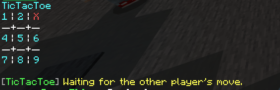
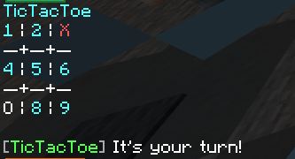

# FrostTicTacToe Plugin for Pocketmine MP

## Overview

FrostTicTacToe is a Pocketmine MP plugin that adds a fun and interactive TicTacToe game to your Minecraft server. Players can start, join, and manage TicTacToe games through a series of simple commands. This plugin is perfect for adding an extra layer of entertainment to your server, allowing players to challenge each other to quick and strategic TicTacToe matches.



## Features

- Start a new TicTacToe game.
- Join an existing game.
- Get a list of all active games.
- End an active TicTacToe game.
- Get help and usage instructions.
- Configurable winning reward amount.

## Commands

### /fttt start
Start a new TicTacToe game.

**Usage:**
```
/fttt start
```

### /fttt join "GAMERTAG"
Join an existing TicTacToe game started by another player.

**Usage:**
```
/fttt join "GAMERTAG"
```

### /fttt help
Display help information and command usage instructions.

**Usage:**
```
/fttt help
```

### /fttt end
End an active TicTacToe game that you have started or joined.

**Usage:**
```
/fttt end
```

### /fttt list
Get a list of all active TicTacToe games on the server.

**Usage:**
```
/fttt list
```

## Installation

1. Download the latest release of the FrostTicTacToe plugin from the [Poggit releases page SOON](https://github.com/DEVILxD5919/FrostTicTacToe/).
2. Place the downloaded `.phar` file into the `plugins` folder of your Pocketmine MP server.
3. Ensure you have the [BedrockEconomy]([https://github.com/BedrockEconomy/BedrockEconomy](https://poggit.pmmp.io/p/BedrockEconomy/4.0.4)) plugin installed, as FrostTicTacToe depends on it for in-game currency functionalities.
4. Restart your server to load the plugin.

## Configuration

1. Navigate to the `plugin_data/FrostTicTacToe` directory in your Pocketmine MP server folder.
2. Open the `config.yml` file.
3. Set the winning reward amount in the configuration file. 

**Example `config.yml`:**
```yaml
# FrostTicTacToe Configuration

reward:
  money: 100
```

4. Save the `config.yml` file and restart your server for the changes to take effect.

## Contributing

Contributions are welcome! If you find any bugs or have suggestions for new features, please open an issue on the [GitHub repository](https://github.com/yourusername/FrostTicTacToe). Pull requests are also appreciated.

## License

This project is licensed under the Apache License 2.0. See the [LICENSE](https://github.com/DEVILxD5919/FrostTicTacToe/blob/main/LICENSE) file for details.

## Support

If you need help or have any questions, feel free to open an issue on GitHub or contact the plugin developer at [your email address].

Enjoy playing TicTacToe on your server with FrostTicTacToe!
